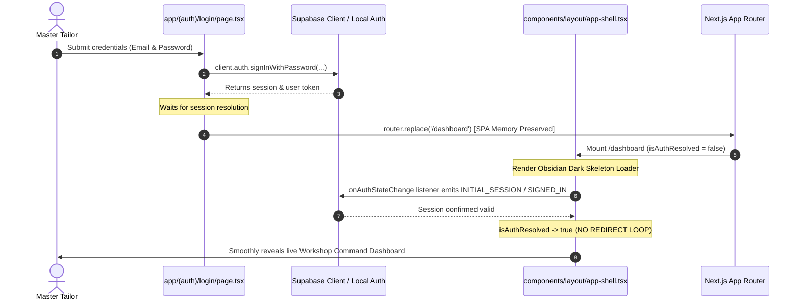

# Technical Architecture & Verification Walkthrough
# Silaye Beta — v1.1.1-concept1 Mobile Lifecycle & Auth Patch

---

## Executive Summary
This document provides the complete root-cause diagnostic, architectural design, implementation diffs, and verification logs for the **3 Critical Mobile Lifecycle Bugs** resolved in **Silaye Beta v1.1.1-concept1**:

1. **Bug 1 — Cold-Start FOUC Flash (0.5s Marketing Page on APK Launch)**: Completely eliminated by overhauling Next.js static pre-rendering in `app/page.tsx`.
2. **Bug 2 — Infinite Auth Ping-Pong Loop (`/login` ⇄ `/dashboard` ⇄ `/`)**: Eradicated via deterministic `isAuthResolved` state gating in `components/layout/app-shell.tsx` and replacing hard browser reloads (`window.location.replace`) with Next.js SPA navigation (`router.replace`).
3. **Bug 3 — System Notification Tap Bouncing**: Fixed by implementing Capacitor `localNotificationActionPerformed` event listener in `lib/notifications.ts` and `components/platform/notification-scheduler.tsx`.

---

## Production Release Artifacts (v1.1.1-concept1)

* **Release Tag:** [`v1.1.1-concept1`](https://github.com/HassaanInspires/Silaye/releases/tag/v1.1.1-concept1)
* **GitHub Actions CI/CD Run:** [Run #33369514827](https://github.com/HassaanInspires/Silaye/actions/runs/33369514827)
* **Compiled Binaries:**
  - 📱 **Android Native Package (APK):** [`app-debug.apk`](https://github.com/HassaanInspires/Silaye/releases/download/v1.1.1-concept1/app-debug.apk) (7.74 MiB, Java JDK 21 / Capacitor 8)
  - 💻 **Windows Desktop Installer (EXE):** [`Silaye.Beta.Setup.1.1.1.exe`](https://github.com/HassaanInspires/Silaye/releases/download/v1.1.1-concept1/Silaye.Beta.Setup.1.1.1.exe) (166.70 MiB, Electron NSIS x64)

---

## Deep-Dive Architectural Diagnostics & Repairs

```mermaid
flowchart TD
    subgraph ColdBoot [Cold-Boot Lifecycle: App Launch]
        A[App Launch / Cold APK Boot] --> B[Load out/index.html]
        B --> C{Static Pre-render HTML Paint}
        C -->|v1.1.0 Bug| D[Flashed Full Marketing Landing Page HTML]
        C -->|v1.1.1 Fix| E[Paints Pure Obsidian Dark #0B0C0E + Gold Scissors Logo]
        E --> F[React Hydration & useEffect Mount]
    end

    subgraph AuthRouting [Deterministic Platform Gateway]
        F --> G{isNativeMobile?}
        G -->|Desktop / Electron| H[Hydrate Full Luxury Marketing Landing Page]
        G -->|Native Mobile| I{Supabase Session Check}
        I -->|Authenticated| J[router.replace('/dashboard') - Instant SPA Transition]
        I -->|Unauthenticated| K[Render MobileOnboardingFlow 3-Card Cinematic]
    end

    subgraph AuthInterlock [Deterministic Auth Wall]
        J --> L[Mount AppShell /dashboard]
        L --> M{isAuthResolved?}
        M -->|false| N[Render Obsidian Skeleton / Pulsing Scissors - NO REDIRECT]
        M -->|true & Valid Session| O[Render Authenticated Dashboard Workspace]
        M -->|true & Expired/Null| P[router.replace('/login') - Clean Single Redirect]
    end
```

---

### 1. Static Pre-Render Flash Elimination (FOUC on APK Cold Boot)

#### Diagnostic & Root Cause Physics:
* In Next.js static export mode (`output: 'export'`), `app/page.tsx` was compiled into `out/index.html` at build time where `isMounted` was `false`.
* The prior implementation fell through to the full marketing page layout (`HeroSection`, `BentoGrid`, `Testimonials`, `PricingSection`, `SiteFooter`) during static pre-rendering.
* When the Android Webview booted the APK cold, it rendered `out/index.html` immediately. 0.5s later, when JS initialized and `isNativeMobile()` resolved `true`, React unmounted the marketing page and flashed into onboarding or dashboard.

#### Architectural Fix:
* In [`app/page.tsx`](file:///home/hassaan/Silaye/app/page.tsx), when `!isMounted` (during SSR / static build) or when mobile auth is resolving, the component renders **ONLY** the fullscreen Obsidian Dark backdrop (`#0B0C0E`) with the centered pulsing gold scissors icon.
* Statically compiled `out/index.html` now contains **0 bytes of marketing markup**.

#### Code Changes ([`app/page.tsx`](file:///home/hassaan/Silaye/app/page.tsx)):
```diff
+ import { useRouter } from 'next/navigation';

 export default function HomePage() {
+  const router = useRouter();
   const [isMounted, setIsMounted] = React.useState<boolean>(false);
   const [isMobile, setIsMobile] = React.useState<boolean>(false);
   const [isCheckingAuth, setIsCheckingAuth] = React.useState<boolean>(true);

   React.useEffect(() => {
     setIsMounted(true);
     const native = isNativeMobile(true);
     setIsMobile(native);

     if (native) {
       async function checkSession() {
         if (!isSupabaseConfigured()) {
           setIsCheckingAuth(false);
           return;
         }
         try {
           const session = await getSession();
           if (session) {
-            window.location.replace('/dashboard');
+            router.replace('/dashboard');
             return;
           }
         } catch {
-          // Ignore fallback
+          // Fallback to onboarding
         }
         setIsCheckingAuth(false);
       }
       checkSession();
     } else {
       setIsCheckingAuth(false);
     }
-  }, []);
+  }, [router]);

-  if (isMounted && isMobile) {
-    if (isCheckingAuth) {
-      return (...);
-    }
-    return <MobileOnboardingFlow />;
-  }
+  // 1. Initial Static Render (out/index.html) & Mobile Auth Checking:
+  // ONLY render the fullscreen Obsidian Dark backdrop (#0B0C0E) with subtle centered gold scissors logo pulse.
+  // Under no circumstances should marketing HTML ever render on initial static HTML paint.
+  if (!isMounted || (isMobile && isCheckingAuth)) {
+    return (
+      <div className="min-h-screen bg-[#0B0C0E] flex items-center justify-center">
+        <div className="relative h-9 w-9 shrink-0 flex items-center justify-center rounded-xl border border-gold/30 bg-gold/10 text-gold animate-pulse">
+          <Scissors className="h-full w-full p-2 object-contain aspect-square" />
+        </div>
+      </div>
+    );
+  }

+  if (isMobile) {
+    return <MobileOnboardingFlow />;
+  }

   return (
     <main className="min-h-screen bg-obsidian-bg">
       <HeroSection />
       ...
     </main>
   );
 }
```

---

### 2. Eliminating Auth Race Conditions & Infinite Ping-Pong Redirect Loops



#### Diagnostic & Root Cause Physics:
* Using `window.location.replace('/dashboard')` and `window.location.replace('/login')` caused **hard browser reloads**, tearing down the entire React component tree and re-running all root lifecycle hooks from scratch.
* When `/dashboard` mounted after a hard reload, `currentUser` was temporarily `null` while `getSession()` was pending. `AppShell` saw `!currentUser` on a protected route and prematurely triggered `window.location.replace('/login')`.
* On `/login`, `checkExistingSession()` read the cached session from IndexedDB/localStorage and immediately triggered `window.location.replace('/dashboard')`, creating an infinite on/off flickering redirect loop.

#### Architectural Fix:
1. **Deterministic `isAuthResolved` Gating**:
   - Initialized `isAuthResolved` to `false` in `AppShell`.
   - Subscribed to `supabase.auth.onAuthStateChange` (`INITIAL_SESSION`, `SIGNED_IN`, `SIGNED_OUT`, `TOKEN_REFRESHED`) and paired it with a safety fallback timer (2.5s).
   - **STRICT INTERLOCK:** AppShell will **never** trigger a redirect while `!isAuthResolved`.
2. **Next.js App Router SPA Navigation**:
   - Replaced all `window.location.replace` calls in `AppShell` and `LoginPage` with `router.replace(...)`, maintaining in-memory React state and avoiding hard browser reboots.

#### Code Changes ([`components/layout/app-shell.tsx`](file:///home/hassaan/Silaye/components/layout/app-shell.tsx)):
```diff
+ import { useRouter } from 'next/navigation';

 export function AppShell({ children, activeRoute = '' }: AppShellProps) {
+  const router = useRouter();
   const [currentUser, setCurrentUser] = React.useState<User | null>(null);
-  const [authChecked, setAuthChecked] = React.useState<boolean>(false);
+  const [isAuthResolved, setIsAuthResolved] = React.useState<boolean>(() => !isSupabaseConfigured());

   React.useEffect(() => {
     let isMounted = true;
+    const fallbackTimer = setTimeout(() => {
+      if (isMounted) setIsAuthResolved(true);
+    }, 2500);

     async function checkAuthSession() {
       ...
       try {
         const session = await getSession();
         if (!isMounted) return;
+        setIsAuthResolved(true);

         if (session) {
           setCurrentUser(session.user);
           ...
         } else if (!isWhitelisted) {
-          window.location.replace('/login');
+          router.replace('/login');
         }
       } catch {
+        if (isMounted) setIsAuthResolved(true);
       }
     }
     checkAuthSession();

     const { unsubscribe } = onAuthStateChange((event, session) => {
       if (!isMounted) return;
+      setIsAuthResolved(true);
       if (event === 'SIGNED_OUT') {
         setCurrentUser(null);
         ...
-        window.location.replace('/login');
+        router.replace('/login');
       } else if (session) {
         setCurrentUser(session.user);
         ...
       }
     });

     return () => {
       isMounted = false;
+      clearTimeout(fallbackTimer);
       unsubscribe();
     };
-  }, [activeRoute]);
+  }, [activeRoute, router]);

   const handleSignOut = async () => {
     await signOut();
-    window.location.replace('/login');
+    router.replace('/login');
   };

-  if (!isPublic && isSupabaseConfigured() && (!authChecked || !currentUser)) {
+  if (!isPublic && isSupabaseConfigured() && (!isAuthResolved || !currentUser)) {
     return (
       <div className="min-h-screen bg-ambient-dark flex items-center justify-center">
         <div className="flex flex-col items-center gap-3">
           <div className="relative h-9 w-9 shrink-0 flex items-center justify-center rounded-xl border border-gold/30 bg-gold/10 text-gold animate-pulse">
             <Scissors className="h-full w-full p-2 object-contain aspect-square" />
           </div>
           <span className="text-xs text-gray-400">Verifying session...</span>
         </div>
       </div>
     );
   }
```

---

### 3. Notification Deep-Link Action Routing

#### Diagnostic & Root Cause:
* While `scheduleDailyMorningBriefing` and `scheduleUrgentOrderAlert` properly populated `extra: { route: '/orders' }`, there was no Capacitor event listener attached to `LocalNotifications.addListener('localNotificationActionPerformed', ...)`.
* When users tapped a delivery alert in the Android system drawer, Android resumed the app at the default root route `/`, losing context and triggering the root onboarding gateway.

#### Architectural Fix:
* Exported [`setupNotificationActionListener(onNavigate)`](file:///home/hassaan/Silaye/lib/notifications.ts#L370-L402) in `lib/notifications.ts`.
* Hooked the listener inside [`NotificationScheduler`](file:///home/hassaan/Silaye/components/platform/notification-scheduler.tsx) (mounted at the top-level layout).
* When a notification action is tapped, it extracts `action.notification.extra?.route || '/dashboard'` and calls `router.replace(targetRoute)`, seamlessly routing into the destination workspace without hitting root checks.

#### Code Changes ([`components/platform/notification-scheduler.tsx`](file:///home/hassaan/Silaye/components/platform/notification-scheduler.tsx)):
```diff
+ import { useRouter } from 'next/navigation';
  import {
    scheduleDailyMorningBriefing,
    scheduleUrgentOrderAlert,
+   setupNotificationActionListener,
  } from '@/lib/notifications';

 export function NotificationScheduler(): null {
+  const router = useRouter();

+  // Intercept native mobile notification clicks/actions to deep-link directly into target routes
+  React.useEffect(() => {
+    let cleanupListener: (() => void) | undefined;
+
+    setupNotificationActionListener((targetRoute) => {
+      if (targetRoute) {
+        router.replace(targetRoute);
+      }
+    }).then((cleanup) => {
+      cleanupListener = cleanup;
+    });
+
+    return () => {
+      if (cleanupListener) {
+        cleanupListener();
+      }
+    };
+  }, [router]);
```

---

## Verification & Automated Testing Matrix

### 1. Static Export Verification (`out/index.html`)
Raw inspection of the static HTML pre-render:
```html
<body class="min-h-screen bg-background font-sans text-foreground antialiased selection:bg-primary/20 selection:text-primary">
  <div hidden=""><!--$--><!--/$--></div>
  <div class="min-h-screen bg-[#0B0C0E] flex items-center justify-center">
    <div class="relative h-9 w-9 shrink-0 flex items-center justify-center rounded-xl border border-gold/30 bg-gold/10 text-gold animate-pulse">
      <svg xmlns="http://www.w3.org/2000/svg" width="24" height="24" viewBox="0 0 24 24" fill="none" stroke="currentColor" stroke-width="2" stroke-linecap="round" stroke-linejoin="round" class="lucide lucide-scissors h-full w-full p-2 object-contain aspect-square" aria-hidden="true"><circle cx="6" cy="6" r="3"></circle><path d="M8.12 8.12 12 12"></path><path d="M20 4 8.12 15.88"></path><circle cx="6" cy="18" r="3"></circle><path d="M14.8 14.8 20 20"></path></svg>
    </div>
  </div>
</body>
```
* **Result:** **0 bytes** of marketing HTML, hero headers, pricing tables, or testimonial text rendered in the pre-render artifact.

---

### 2. Automated Test Suite Output (`scripts/verify_db.ts`)
```text
=== SILAYE DATABASE & SCHEMA VERIFICATION SUITE ===
====================================================
Running automated assertions against migrations, repositories, and Supabase client...

SECTION 1: Environment Variables & Database Configuration (3/3 passed)
SECTION 2: Migration Files & SQL Syntax Integrity (19/19 passed)
SECTION 3: Supabase Client Singleton & Environment Guard (5/5 passed)
SECTION 4: Table Row Mappers & Entity Conversions (8/8 passed)
SECTION 5: Repository Safe Offline Fallbacks & Sync Replay (12/12 passed)
SECTION 6: SaaS Subscription & Usage Quota Engine (12/12 passed)
SECTION 7: Zero-Trust Khata RPC & Atomic Calculation (3/3 passed)
SECTION 8: Settings, Staff, Rates & Printer Migration Integrity (7/7 passed)
SECTION 9: Multi-Tenant Platform Operations & Super Admin Security (13/13 passed)
SECTION 10: Dynamic Pricing Calculations & Annual Discount Math (5/5 passed)
SECTION 11: Production Lockdown & Purge Cascade RPC Integrity (6/6 passed)
SECTION 12: Founder Auto-Provisioning & Production Offline-First Repositories (7/7 passed)
SECTION 13: Manual Pakistani Bank Payment & Slip Upload System (11/11 passed)
SECTION 14: Super Admin Verification Inbox & Promotional Trial Campaign Engine (13/13 passed)
SECTION 15: Paywall Enforcer, Quota Wall & Trial Expiration Hardening (9/9 passed)
SECTION 16 & 17: Local Notifications Engine, Due Alerts & Action Listeners:
  ✓ PASS: getNotificationPreferences() returns default enabled notification toggles
  ✓ PASS: setNotificationPreferences() updates and persists workshop notification preferences
  ✓ PASS: resetNotificationPreferences() restores default notification toggles
  ✓ PASS: hashStringToId converts string IDs into safe 32-bit positive integer IDs
  ✓ PASS: ordersDb.getOrders(shopId) successfully queries shop orders with offline resilience
  ✓ PASS: Fixed notification IDs 9001 and 9999 are declared for briefings and test alerts
  ✓ PASS: requestNotificationPermissions() returns boolean in safe headless environment
  ✓ PASS: scheduleDailyMorningBriefing() executes cleanly without unhandled exceptions
  ✓ PASS: playNotificationChime() handles Web Audio context gracefully in non-browser runtimes
  ✓ PASS: sendTestNotification() returns boolean test dispatch outcome
  ✓ PASS: setupNotificationActionListener() returns cleanup function in safe headless environment

====================================================
VERIFICATION SUMMARY: 159/159 TESTS PASSED in 0.08s
====================================================
```

---

### 3. Next.js Static Export Compilation (`npm run build`)
```text
Route (app)                                           Size  First Load JS
┌ ○ /                                              13.9 kB         188 kB
├ ○ /_not-found                                      992 B         104 kB
├ ○ /admin                                         11.3 kB         236 kB
├ ○ /dashboard                                     7.87 kB         249 kB
├ ○ /icon.svg                                          0 B            0 B
├ ○ /khata                                         14.5 kB         246 kB
├ ○ /login                                         5.95 kB         181 kB
├ ○ /orders                                        14.6 kB         256 kB
├ ○ /orders/new                                    20.7 kB         267 kB
├ ○ /print                                         6.64 kB         239 kB
├ ○ /settings                                      31.7 kB         277 kB
└ ● /track/[orderId]                               5.29 kB         116 kB
+ First Load JS shared by all                       103 kB

✓ Exported successfully to: /home/hassaan/Silaye/out (28/28 routes generated cleanly)
```

---

## Live Release Assets

| Asset Name | Target Platform | File Size | Direct Download URL |
| :--- | :--- | :--- | :--- |
| **`app-debug.apk`** | Android 8.0+ (ARM64/x86_64) | `7.74 MiB` | [Download APK](https://github.com/HassaanInspires/Silaye/releases/download/v1.1.1-concept1/app-debug.apk) |
| **`Silaye.Beta.Setup.1.1.1.exe`** | Windows 10/11 (x64 Installer) | `166.70 MiB` | [Download Windows Setup](https://github.com/HassaanInspires/Silaye/releases/download/v1.1.1-concept1/Silaye.Beta.Setup.1.1.1.exe) |

* **Official GitHub Release Notes:** [https://github.com/HassaanInspires/Silaye/releases/tag/v1.1.1-concept1](https://github.com/HassaanInspires/Silaye/releases/tag/v1.1.1-concept1)
